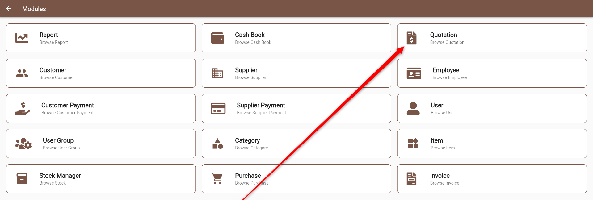

We have a separate module for Questions. You can see this in the Modules list. 

To make it easier, customers are allowed to create quotations from Invoice itself by selecting **Invoice** **Type** as **Quotation** as below 

but the **Quotations** will be moved automatically into Module **Quotations.** You can access this from Modules as below 

  
\
**Note:** You cannot add new Quotation from this Module. You will have to add it from Invoice itself. 
